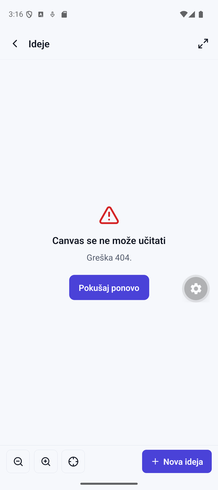
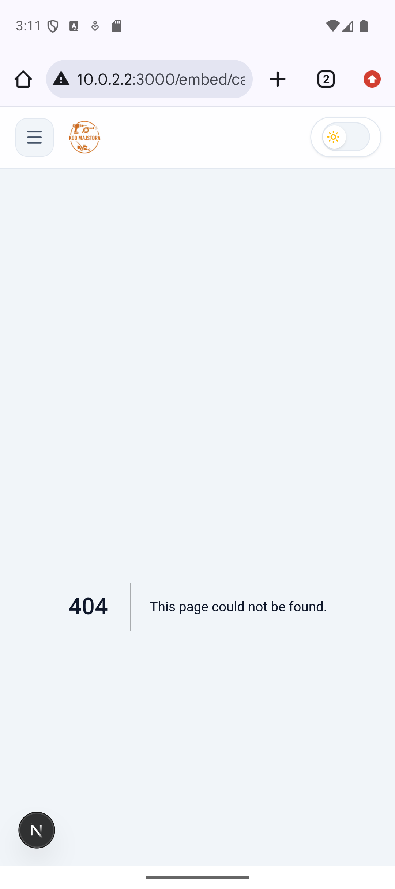
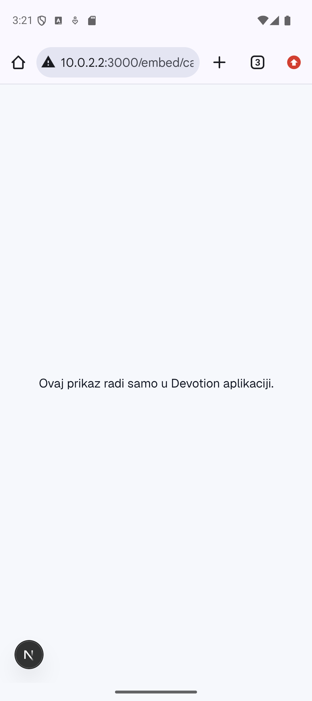
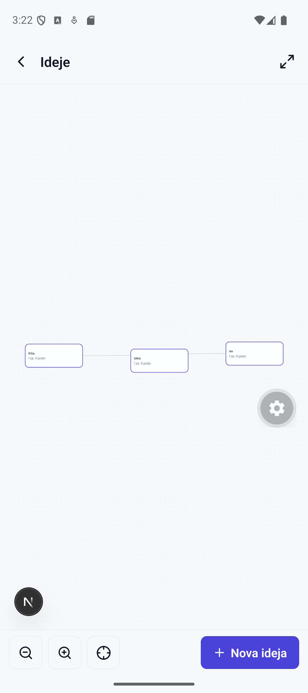
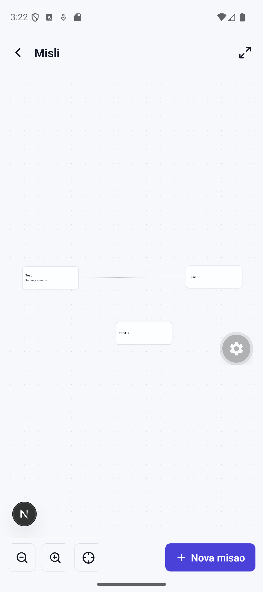

# Kanvas 404 na emulatoru: dijagnoza i popravka

> Datum: 2026-08-10 · Grana: `paritet-20260810-0252` (Faza 0 lanca pariteta)
>
> Simptom: svaki kanvas u aplikaciji (Ideje, Misli, oblast, stranica) vraća
> „Canvas se ne može učitati — Greška 404." Ruta
> `apps/web/app/embed/canvas/[kind]/[id]/page.tsx` postoji na disku i ispravna
> je — problem uopšte nije bio u kodu.

| | |
|---|---|
| Pre — aplikacija |  |
| Pre — Chrome u emulatoru |  |
| Posle — Chrome u emulatoru |  |
| Posle — kanvas Ideje |  |
| Posle — kanvas Misli |  |

---

## Dva uzroka, oba potvrđena

### Uzrok 1: na portu 3000 je radio tuđi projekat — `alati`

Telefon (i canvas WebView) gađa `http://10.0.2.2:3000` (`EXPO_PUBLIC_WEB_URL`).
Na 3000 je slušao dev server projekta **`alati`** — drugi Next.js sajt bez
`/embed/*` ruta, pa svaki embed zahtev dobije njegovu 404 stranicu (to je ono
tuđe zaglavlje sa screenshot-a: hamburger, narandžasti logo „KOD MAJSTORA",
sun prekidač). Devotion, pokrenut kasnije, **tiho je pobegao na 3001** — niko
ne primeti jer desktop testiranje ide na „onaj port koji je Next ispisao".

Dokazi, snimljeni uživo pre gašenja (2026-08-10 ~03:10):

```
netstat -ano | findstr ":3000 :3001 :8081"
  TCP 0.0.0.0:3000  LISTENING  19484
  TCP 0.0.0.0:3001  LISTENING  27488
  TCP 0.0.0.0:8081  LISTENING  6300   (Metro — ne dira se)

Get-CimInstance Win32_Process (skraćeno):
  19484: node ...\Web Dev Projects\alati\node_modules\next\dist\server\lib\start-server.js
  27488: node ...\Web Dev Projects\notion-clone\node_modules\next\dist\server\lib\start-server.js

curl -s -o NUL -w "%{http_code}" http://localhost:3000/embed/canvas/ideas/proba  → 404
curl -s -o NUL -w "%{http_code}" http://localhost:3001/embed/canvas/ideas/proba  → 200
```

**Zamka pri gašenju: proces se regeneriše.** `next dev` je lanac
`npm run dev` → `cmd /c next dev` → `node next dev` (master) → `node
start-server.js` (dete koje drži port). Ubijanje samo deteta ne pomaže —
master odmah podigne novo (viđeno uživo: 19484 je zamenjen sa 24924 između dva
merenja). Gasi se **celo stablo od `npm run dev` procesa naniže**:

```
taskkill /PID <pid-npm-run-dev> /T /F
```

`alati` nije ponovo pokretan — ako zatreba, korisnik ga sam diže na drugom
portu (`next dev -p 3002` ili slično).

### Uzrok 2: bez `allowedDevOrigins` hidracija visi (prazan kanvas, nula grešaka)

I posle vraćanja Devotiona na 3000, kanvas bi ostao **prazan bez ijedne
greške**: Next 16 dev server vraća 403 na `/_next/webpack-hmr` websocket za
origin van allowlist-a (`10.0.2.2` ≠ `localhost`), a React-ov debug kanal u
dev-u putuje baš tim socketom — flight čitač čeka debug zavisnosti koje nikad
ne stignu i hidracija se nikad ne završi. Stranica zauvek ostane na SSR
„boot" div-u.

Ovo je već jednom u celosti bisektovano (CDP nad WebView-om, izvorni kod
Next-a) na grani `ui-nocni-20260809-0931`; pun trag sa svih 5 karika:

```
git show paritet-20260810-0159:docs/mobile/KANVAS-DIJAGNOZA.md
```

Popravka (ista, dokazana): `allowedDevOrigins: ["10.0.2.2"]` u
`apps/web/next.config.ts`. Važi samo za dev server; fizički telefon preko
LAN-a traži da se u isti niz doda i LAN IP računara.

**Ko popravi samo uzrok 1, pada na uzrok 2** i pomisli da je bag u kodu
embeda. Nije — u kodu embeda, mobilnog ekrana i backenda nije promenjeno ništa.

---

## Šta je promenjeno, fajl po fajl

| Fajl | Izmena |
|---|---|
| `apps/web/next.config.ts` | `allowedDevOrigins: ["10.0.2.2"]` + komentar zašto |
| `apps/web/package.json` | `"dev": "next dev"` → `"dev": "next dev -p 3000"` — sledeće otimanje porta obara start **glasno** umesto tihog bežanja na 3001. Provereno: drugi `npm run dev` na zauzet 3000 izlazi sa greškom (exit 1) i ništa ne sluša na 3001. |
| `docs/mobile/KANVAS-DIJAGNOZA.md` | Ovaj izveštaj |
| `docs/mobile/kanvas-dijagnoza/*.png` | Dokazi pre/posle |
| `docs/mobile/ZA-POPRAVKU.md` | Zamke Z3 (otet port) i Z4 (`allowedDevOrigins`) |
| `docs/mobile/PARITET.md` | Sekcija 0 zatvorena |

`apps/mobile`, `packages/backend` i `.env.local` — **nula izmena**
(`EXPO_PUBLIC_WEB_URL=http://10.0.2.2:3000` je sve vreme bio ispravan).

---

## Provera za 10 sekundi: da li je pravi server na 3000?

```
curl.exe -s -o NUL -w "%{http_code}" http://localhost:3000/embed/canvas/ideas/proba
```

| Rezultat | Značenje |
|---|---|
| `200` | Devotion je na 3000 — sve u redu |
| `404` | port drži tuđi projekat → nađi i ugasi celo stablo (vidi gore) |
| ništa / greška | server ne radi → `npm run dev` iz root-a `notion-clone` |

Ako `npm run dev` javi „port 3000 in use" a provera vraća `200` — Devotion
**već radi**, ne diraj ništa.

A/B proba hidracije bez aplikacije (posle svake promene dev okruženja):

```
adb shell am start -a android.intent.action.VIEW -d "http://10.0.2.2:3000/embed/canvas/ideas/proba" com.android.chrome
```

Vidiš „Ovaj prikaz radi samo u Devotion aplikaciji." → server + mreža +
hidracija svi rade. Vidiš prazno sivo → origin blokiran ili server pao.

---

## Tok popravke (redosled koji je radio)

1. `netstat`/`Get-CimInstance` — identitet oba procesa snimljen (gore).
2. „Pre" screenshotovi iz aplikacije i iz Chrome-a u emulatoru.
3. `taskkill /T /F` nad `npm run dev` stablom `alati`-ja; ubijen i zalutali
   Devotion na 3001. Portovi provereni prazni.
4. `allowedDevOrigins` + pin porta (izmene iznad).
5. `npm run check` — prolazi (2 zatečena eslint upozorenja u backendu,
   nevezana: `areasV2.ts` neiskorišćen import, `chat.ts` neiskorišćena
   promenljiva — zapisano, ne popravljano u ovoj fazi).
6. Devotion podignut kroz `Start-Process cmd /c npm run dev` (preživljava kraj
   agent sesije); embed ruta vraća 200; identitet potvrđen kroz `netstat` +
   `CommandLine` (sadrži `notion-clone`).
7. Provera pina: drugi `npm run dev` na zauzet 3000 pada glasno, 3001 ostaje
   prazan. ✔
8. P1 Chrome u emulatoru → poruka za browser (hidracija OK). P2 aplikacija →
   „Pokušaj ponovo" → **kanvas crta** (Ideje: 3 oblačića + veze; Misli: 3
   čvora + veza). Dev-client relaunch posle force-stop ume da traži ponovno
   povezivanje na Metro — deep link
   `devotion://expo-development-client/?url=http%3A%2F%2F10.0.2.2%3A8081`
   rešava bez klikanja po listi servera.
